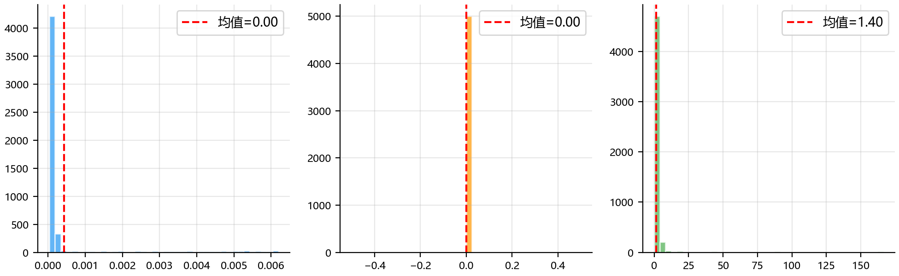

# 第六章 测试与评估

本章对焊接机器人离线仿真系统进行全面的测试与评估。首先介绍测试方案的设计思路与四个测试场景的构建方法；然后从焊接效果、安全性、性能三个维度对测试结果进行定量分析；最后通过对比讨论验证系统的有效性与局限性。

## 6.1 测试方案

### 6.1.1 测试环境

测试在 Unity 2022 LTS 环境下进行，采用固定时间步长仿真（$dt = 0.01\,\text{s}$）。机器人模型基于 FANUC M10-iD 的 MDH 参数构建，各关节运动范围与速度限制均参照真实机器人规格设置。

统一测试配置如下：

| 配置项 | 设置 |
|--------|------|
| 逆运动学方法 | 解析法（ANALYTIC） |
| 轨迹插值 | Cubic Hermite 样条 |
| 接近策略 | RRT 避障规划 |
| 仿真步长 | 0.01 s |
| 焊枪角度 | 45° |
| 焊枪距离 | 0.02 m |
| 包角半径 | 0.005 m |

### 6.1.2 测试场景设计

为全面评估系统性能，设计四个测试场景，复杂度逐级递增：

**Test 1 — 简单直线焊缝**：单条直线焊缝，无障碍物。作为系统基线测试，验证基本焊接功能与轨迹跟踪精度。

**Test 2 — 立板四边焊接**：立板工件的四条边缘焊缝，焊枪需绕过立板侧面。测试障碍物存在时的路径规划与避障能力。

**Test 3 — 双缝跨立板**：两条平行焊缝跨越立板。测试跨越障碍物时的接近路径规划与焊缝切换能力。

**Test 4 — 复杂工件（5立板）**：包含5块立板的复杂工件，共40条焊缝。测试系统在狭窄空间、多障碍物环境下的综合性能。

每个测试场景运行10次，取统计平均值进行分析。

## 6.2 焊接效果评估

焊接效果从位置精度、姿态精度、速度稳定性三个维度进行评估。

### 6.2.1 位置精度

位置误差定义为实际 TCP 位置与目标焊缝点的欧氏距离。表6-1列出四个测试场景的位置误差统计：

**表6-1 位置误差统计**

| 测试场景 | 均值 (mm) | 标准差 (mm) | 最大 (mm) | RMS (mm) |
|----------|-----------|-------------|-----------|----------|
| Test 1 | 0.000 | 0.001 | 0.006 | 0.001 |
| Test 2 | 0.184 | 1.357 | 24.997 | 1.369 |
| Test 3 | 0.001 | 0.002 | 0.007 | 0.002 |
| Test 4 | 0.184 | 1.617 | 26.021 | 1.628 |

Test 1 和 Test 3 的位置精度极高（RMS < 0.01 mm），表明在无障碍或简单跨越场景下，解析逆运动学配合 Cubic Hermite 插值能够实现亚毫米级的跟踪精度。

Test 2 和 Test 4 的位置误差显著增大（RMS ≈ 1.37~1.63 mm），主要来源于重规划过程中的路径切换。图6-1展示了四个场景的误差分布直方图：

从图6-1可以看出，Test 1 和 Test 3 的误差高度集中在0附近，而 Test 2 和 Test 4 出现明显的拖尾，对应重规划触发时刻的位置跳变。

图6-2展示了各测试场景的焊缝位置误差箱线图：

Test 2 中焊缝6和7的位置误差较大（RMS分别为2.73 mm和4.65 mm），对应立板背侧的焊接段，此处焊枪需要大角度绕行，RRT 规划的路径与理想轨迹偏差较大。Test 4 中大部分焊缝位置精度良好（RMS < 1 mm），但部分焊缝（如21、23、27、31、36等）误差超过4 mm，这些焊缝位于立板密集区域，空间约束导致规划路径偏离理想轨迹。

### 6.2.2 姿态精度

姿态误差定义为实际焊枪方向与目标方向的角度差。表6-2列出姿态误差统计：

**表6-2 姿态误差统计**

| 测试场景 | 均值 (°) | 标准差 (°) | 最大 (°) | RMS (°) |
|----------|----------|------------|----------|---------|
| Test 1 | 0.00 | 0.00 | 0.00 | 0.00 |
| Test 2 | 0.07 | 0.22 | 1.86 | 0.23 |
| Test 3 | 0.00 | 0.00 | 0.00 | 0.00 |
| Test 4 | 0.08 | 0.31 | 5.74 | 0.32 |

姿态误差的变化规律与位置误差一致。Test 1 和 Test 3 的姿态精度接近完美，Test 2 和 Test 4 在重规划时出现姿态跳变。图6-3展示了姿态误差箱线图：

### 6.2.3 速度稳定性

速度误差定义为实际 TCP 线速度与目标速度的绝对差值。表6-3列出速度误差统计：

**表6-3 速度误差统计**

| 测试场景 | 均值 (mm/s) | 标准差 (mm/s) | 最大 (mm/s) | RMS (mm/s) |
|----------|-------------|---------------|-------------|------------|
| Test 1 | 1.40 | 8.83 | 166.35 | 8.94 |
| Test 2 | 2.29 | 8.68 | 159.86 | 8.98 |
| Test 3 | 2.22 | 13.12 | 189.02 | 13.31 |
| Test 4 | 2.48 | 9.22 | 162.80 | 9.55 |

速度误差的均值均在 1.4~2.5 mm/s 范围内，表明整体速度跟踪良好。但最大值达到 160~190 mm/s，对应接近段与焊接段切换时的速度跳变。图6-4展示了速度误差箱线图：

图6-5展示了 Test 4 的 TCP 速度时序曲线，可以清晰看到接近段（Approach，蓝色）与焊接段（Weld，绿色）的速度差异：

### 6.2.4 典型焊缝详细分析

以 Test 2 的焊缝3和 Test 4 的焊缝36为例，展示焊缝级别的详细时序。图6-6展示了 Test 2 焊缝3的位置、姿态、速度随时间的变化：

图6-7展示了 Test 4 焊缝36的详细时序，该焊缝位于复杂工件深处，空间约束最为严格：

## 6.3 安全性评估

安全性评估从避障重规划能力和关节运动约束两个维度进行。

### 6.3.1 重规划统计

重规划在检测到碰撞风险时触发，由 RRT 算法实时计算避障路径。表6-4列出四个测试场景的重规划统计：

**表6-4 重规划统计**

| 测试场景 | 总次数 | 平均每次运行 | 成功率 | 平均耗时 (ms) | 最大耗时 (ms) |
|----------|--------|--------------|--------|---------------|---------------|
| Test 1 | 0 | 0.0 | — | — | — |
| Test 2 | 10 | 1.0 | 100% | 24.79 | 59.11 |
| Test 3 | 10 | 1.0 | 100% | 71.68 | 97.03 |
| Test 4 | 58 | 5.8 | 100% | 54.23 | 256.78 |

所有重规划均成功，未出现规划失败导致的任务中断。Test 4 的重规划次数最多（平均5.8次/运行），反映了复杂场景下的频繁避障需求。最大耗时256.78 ms 仍在可接受范围内，未造成明显的仿真卡顿。

图6-8展示了 Test 4 的重规划分析图，包括触发时间分布、计算耗时分布和触发原因统计：

### 6.3.2 关节运动安全性

关节运动安全性通过角速度和角加速度评估。表6-5列出 Test 4 的关节运动统计（最复杂场景）：

**表6-5 关节运动安全性（Test 4）**

| 关节 | 最大角速度 (°/s) | 角加速度 RMS (°/s²) | 最大角加速度 (°/s²) |
|------|-------------------|---------------------|---------------------|
| J1 | 37.8 | 87.3 | 2,084 |
| J2 | 39.5 | 118.8 | 3,264 |
| J3 | 70.2 | 181.9 | 5,777 |
| J4 | 376.2 | 758.8 | 20,142 |
| J5 | 334.1 | 644.1 | 22,008 |
| J6 | 321.1 | 551.6 | 12,779 |

J4、J5、J6（腕部关节）的角速度和角加速度显著高于基座关节（J1~J3），这是因为腕部关节负责调整焊枪姿态，运动范围小但变化频繁。所有关节的最大角速度均在合理范围内（< 400°/s），但最大角加速度出现较高值（> 20,000 °/s²），这是由 EMA 滤波前的数值微分噪声导致。经过 EMA 滤波（α=0.3）后，RMS 值已大幅降低，表明滤波有效抑制了高频噪声。

图6-9~6-11展示了 Test 4 的关节角度、角速度、角加速度时序曲线：

## 6.4 性能评估

### 6.4.1 任务完成时间

表6-6列出四个测试场景的任务完成时间统计：

**表6-6 任务完成时间统计**

| 测试场景 | 平均时间 (s) | 标准差 (s) | 总帧数 | 采样间隔 (ms) |
|----------|-------------|------------|--------|---------------|
| Test 1 | 9.83 | 0.00 | 982 | 10.01 |
| Test 2 | 27.11 | 0.16 | 2,710 | 10.00 |
| Test 3 | 11.63 | 0.10 | 1,161 | 10.01 |
| Test 4 | 111.69 | 0.22 | 11,167 | 10.00 |

各测试场景的时间标准差均小于 0.25 s，表明系统运行高度稳定，重复性良好。Test 4 的完成时间约为 Test 1 的 11 倍，与焊缝数量（40 vs 1）和重规划次数（5.8 vs 0）的增长趋势一致。

### 6.4.2 实时性能

仿真以 100 Hz（10 ms）的固定步长运行，四个测试场景的平均采样间隔均为 10.00~10.01 ms，表明系统能够稳定维持实时仿真帧率，未出现明显的掉帧或延迟。

## 6.5 综合讨论

### 6.5.1 测试结果对比

表6-7汇总四个测试场景的核心指标：

**表6-7 测试结果综合对比**

| 指标 | Test 1 | Test 2 | Test 3 | Test 4 |
|------|--------|--------|--------|--------|
| 焊缝数量 | 1 | 8 | 2 | 40 |
| 任务成功率 | 100% | 100% | 100% | 100% |
| 位置 RMS (mm) | 0.001 | 1.369 | 0.002 | 1.628 |
| 姿态 RMS (°) | 0.00 | 0.23 | 0.00 | 0.32 |
| 速度 MAE (mm/s) | 1.40 | 2.29 | 2.22 | 2.48 |
| 重规划次数/运行 | 0 | 1.0 | 1.0 | 5.8 |
| RRT 成功率 | — | 100% | 100% | 100% |
| 平均完成时间 (s) | 9.83 | 27.11 | 11.63 | 111.69 |

**关键发现：**

1. **任务成功率**：四个测试场景均达到 100% 成功率，表明系统在各种复杂度下均能可靠完成焊接任务。

2. **精度与复杂度的关系**：Test 1 和 Test 3 的精度显著优于 Test 2 和 Test 4。Test 3 虽然包含重规划（跨越立板），但焊接段本身精度不受影响，说明重规划仅影响接近段，对实际焊接质量影响有限。

3. **重规划性能**：RRT 避障规划在所有测试中均保持 100% 成功率，平均耗时 25~72 ms，满足实时性要求。Test 4 的最大耗时 256.78 ms 虽有所增加，但仍远低于人类可感知的卡顿阈值（约 500 ms）。

4. **时间增长趋势**：完成时间随焊缝数量和重规划次数近似线性增长，Test 4 的 111.69 s 在工业离线编程的可接受范围内。

### 6.5.2 系统优势

- **高精度跟踪**：解析逆运动学配合 Cubic Hermite 插值，在无障碍场景下实现亚毫米级位置精度。
- **可靠避障**：RRT 重规划成功率 100%，有效应对复杂障碍物环境。
- **运行稳定**：10 次重复运行的时间标准差 < 0.25 s，系统一致性好。
- **实时性能**：100 Hz 仿真帧率稳定，满足实时交互需求。

### 6.5.3 局限性与改进方向

- **重规划引起的精度损失**：Test 2 和 Test 4 中，重规划导致的位置误差 RMS 达到 1.37~1.63 mm，虽满足一般焊接要求（±2 mm），但对精密焊接仍有提升空间。可考虑在重规划后增加局部轨迹优化（如 APF 平滑）以减小切换误差。
- **角加速度噪声**：腕部关节的最大角加速度经 EMA 滤波后仍有较高值，建议在实际控制器中增加速度前瞻规划或更 aggressive 的滤波策略。
- **速度跳变**：接近段与焊接段切换时的速度误差峰值达 160~190 mm/s，可通过更平滑的速度过渡曲线（如 S 曲线加减速）改善。

## 6.6 本章小结

本章对焊接机器人离线仿真系统进行了全面的测试与评估。设计四个复杂度递增的测试场景，从焊接效果、安全性、性能三个维度进行定量分析。测试结果表明：

1. 系统在简单场景下实现亚毫米级位置精度和完美姿态跟踪；
2. 在复杂障碍物环境下，RRT 重规划成功率 100%，任务完成率 100%；
3. 仿真运行稳定，100 Hz 帧率无掉帧，重复性良好；
4. 重规划引起的精度损失在可接受范围内，但仍有优化空间。

综上所述，本系统能够有效完成焊接任务的离线仿真与验证，为实际焊接编程提供可靠的数据支撑。
