# Test 3 — 仿真结果分析报告

**任务名称:** Test 3
**运行次数:** 10
**统一配置:** ANALYTIC | CubicHermite | RRT | dt=0.01s

---

## 1. 总体概览

| 指标 | 均值 (范围) |
|------|------------|
| 仿真时间 | 11.6s (11.5~11.8) |
| 帧数 | 1161 帧 (1148~1180) |
| 重规划次数 | 1.0 次 (1~1) |
| 重规划成功率 | 100.0% (10/10) |
| RRT 平均耗时 | 71.68ms (max=97.03) |
| 任务成功率 | 100.0% (10/10) |
| PlanStatus 分布 | Succeeded=10, Failed=0, Unfinished=0 |

---

## 2. 焊接效果评估

### 2.1 全局误差统计

| 误差指标 | 均值 | 标准差 | 最大 | RMS |
|----------|------|--------|------|-----|
| 位置误差 | 0.001 mm | 0.002 mm | 0.007 mm | 0.002 mm |
| 姿态误差 | 0.00° | 0.00° | 0.00° | 0.00° |
| 速度误差 | 2.22 mm/s | 13.12 mm/s | 189.02 mm/s | 13.31 mm/s |

**总焊接帧数:** 5,000

### 2.2 误差分布直方图

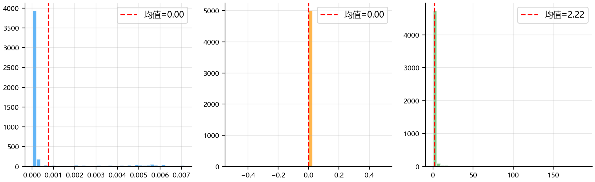

### 2.3 各焊缝误差对比

| 焊缝 ID | 位置 RMS (mm) | 位置 Max (mm) | 姿态均值 (°) | 速度 MAE (mm/s) |
|---------|--------------|--------------|-------------|----------------|
| 1 | 0.00 | 0.01 | 0.00 | 2.21 |
| 2 | 0.00 | 0.01 | 0.00 | 2.22 |

### 2.4 焊缝误差箱线图

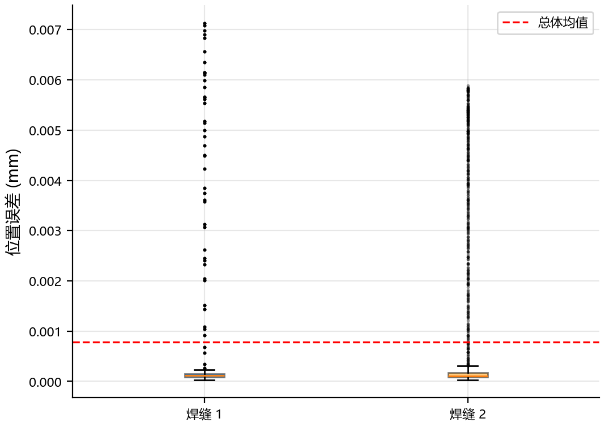

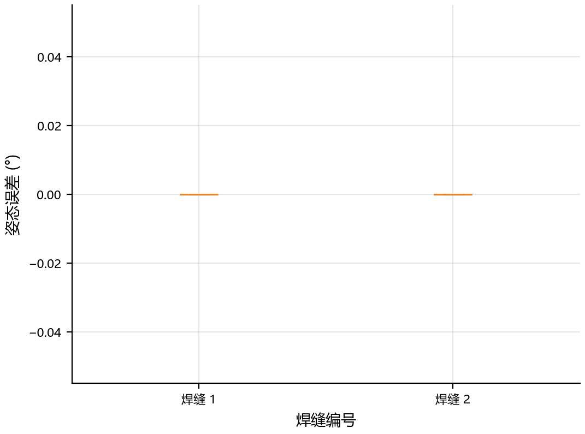

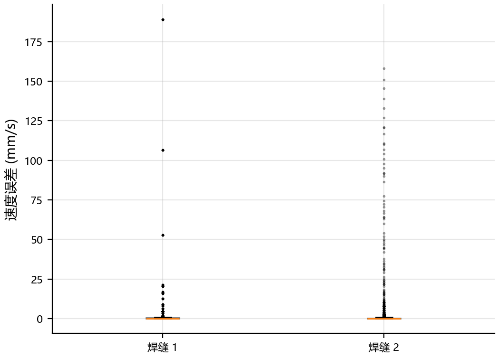

### 2.5 TCP 速度时序

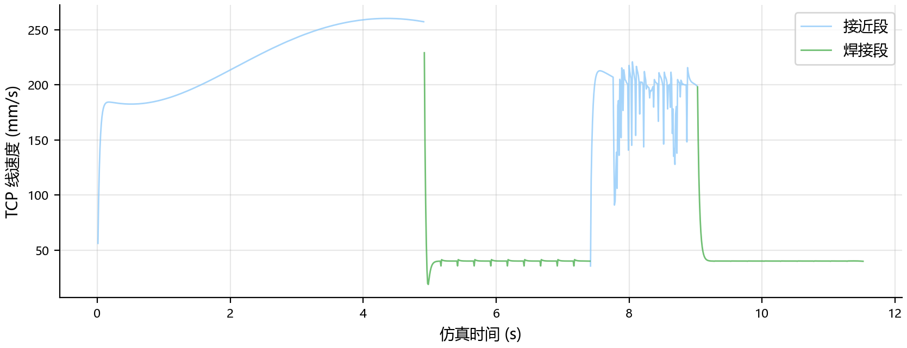

### 2.6 焊缝 #1 详细时序

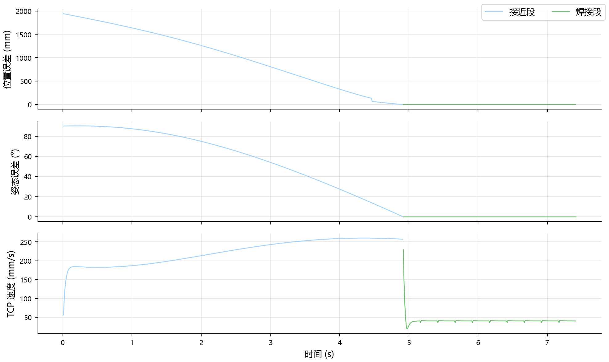

### 2.6 焊缝 #2 详细时序

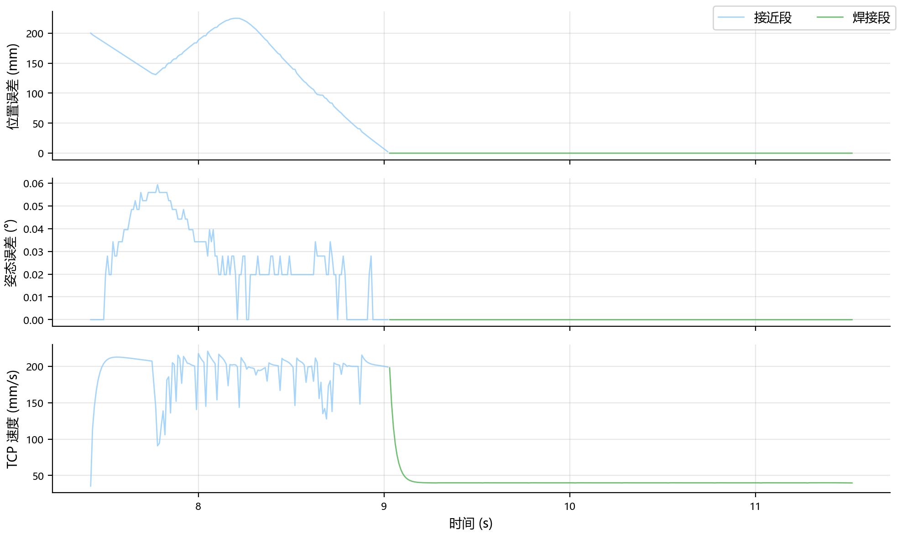

---

## 3. 安全性评估

### 3.1 重规划统计

| 指标 | 值 |
|------|-----|
| 总重规划次数（10 次运行合计） | 10 |
| 平均每次运行重规划次数 | 1.0 |
| RRT 成功率 | 100.0% |
| RRT 平均计算耗时 | 71.68 ms |
| RRT 最大计算耗时 | 97.03 ms |

### 3.2 重规划分析图

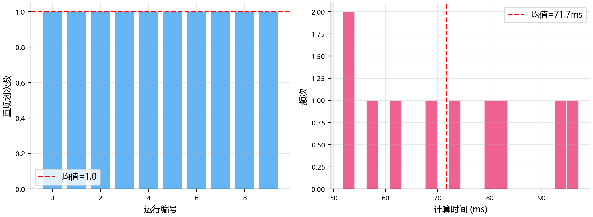

### 3.3 关节运动安全性

| 关节 | 最大角速度 (°/s) | 角加速度 RMS (°/s²) | 最大角加速度 (°/s²) |
|------|-------------------|---------------------|---------------------|
| J0 | 11.735 | 32.539 | 426.771 |
| J1 | 19.376 | 73.636 | 851.984 |
| J2 | 25.094 | 96.926 | 1185.395 |
| J3 | 25.679 | 45.712 | 679.997 |
| J4 | 11.832 | 40.046 | 489.458 |
| J5 | 16.179 | 51.497 | 817.778 |

### 3.4 关节运动时序

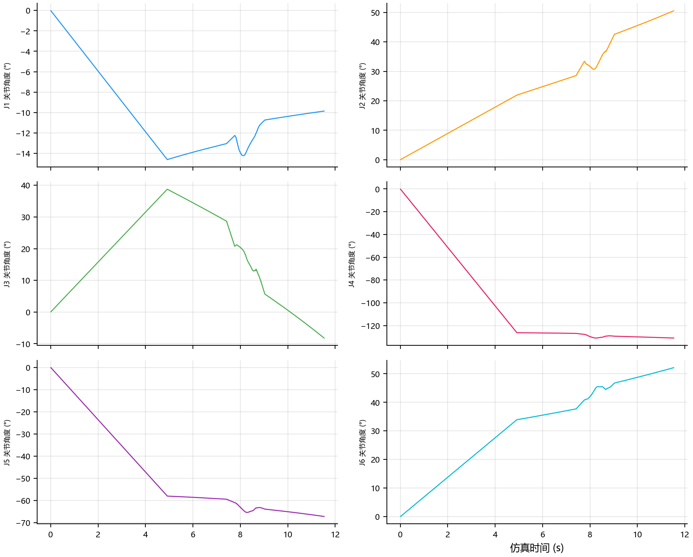

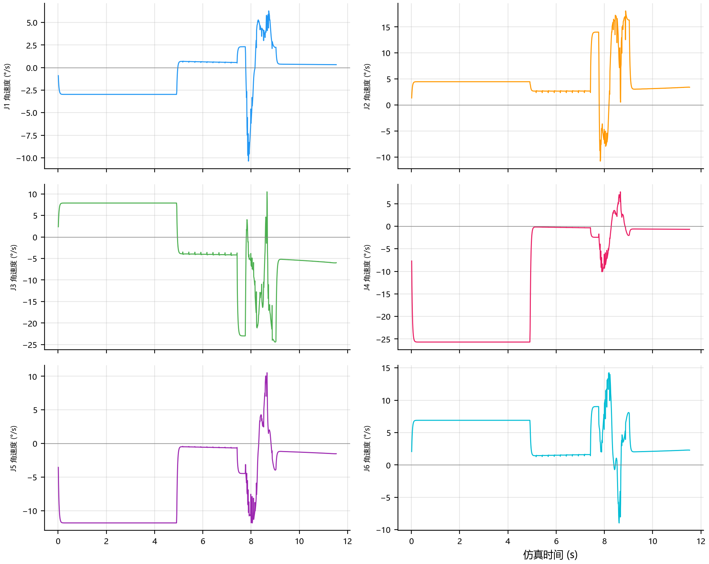

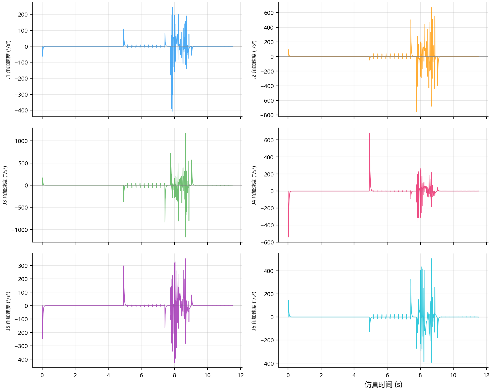

---

## 4. 仿真性能评估

| 指标 | 值 |
|------|-----|
| 平均任务完成时间 | 11.63 s |
| 时间标准差（运行间） | 0.10 s |
| 平均总帧数 | 1161 |
| 平均采样间隔 | 10.01 ms |

---

## 5. 关键发现

1. **任务成功率:** 100.0% (10/10 次运行成功)
2. **焊接精度:** 位置 RMS = 0.00 mm，姿态 MAE = 0.00°
3. **避障能力:** 10 次运行共触发 10 次重规划，成功率 100.0%
4. **运动平滑性:** 各关节加速度 RMS 在合理范围内（基于 EMA 平滑数据，α=0.3）
5. **仿真稳定性:** 任务完成时间标准差 0.10s，系统运行稳定

---

*报告生成时间: 2026-04-28 18:23:54*