# Test 4 — 仿真结果分析报告

**任务名称:** Test 4
**运行次数:** 10
**统一配置:** ANALYTIC | CubicHermite | RRT | dt=0.01s

---

## 1. 总体概览

| 指标 | 均值 (范围) |
|------|------------|
| 仿真时间 | 111.7s (111.4~112.1) |
| 帧数 | 11167 帧 (11141~11212) |
| 重规划次数 | 5.8 次 (5~7) |
| 重规划成功率 | 100.0% (58/58) |
| RRT 平均耗时 | 54.23ms (max=256.78) |
| 任务成功率 | 100.0% (10/10) |
| PlanStatus 分布 | Succeeded=10, Failed=0, Unfinished=0 |

**表现最好焊缝:** #7（位置 RMS 最小）  |  **表现最差焊缝:** #36（位置 RMS 最大）

---

## 2. 焊接效果评估

### 2.1 全局误差统计

| 误差指标 | 均值 | 标准差 | 最大 | RMS |
|----------|------|--------|------|-----|
| 位置误差 | 0.184 mm | 1.617 mm | 26.021 mm | 1.628 mm |
| 姿态误差 | 0.08° | 0.31° | 5.74° | 0.32° |
| 速度误差 | 2.48 mm/s | 9.22 mm/s | 162.80 mm/s | 9.55 mm/s |

**总焊接帧数:** 59,977

### 2.2 误差分布直方图

#### 位置误差

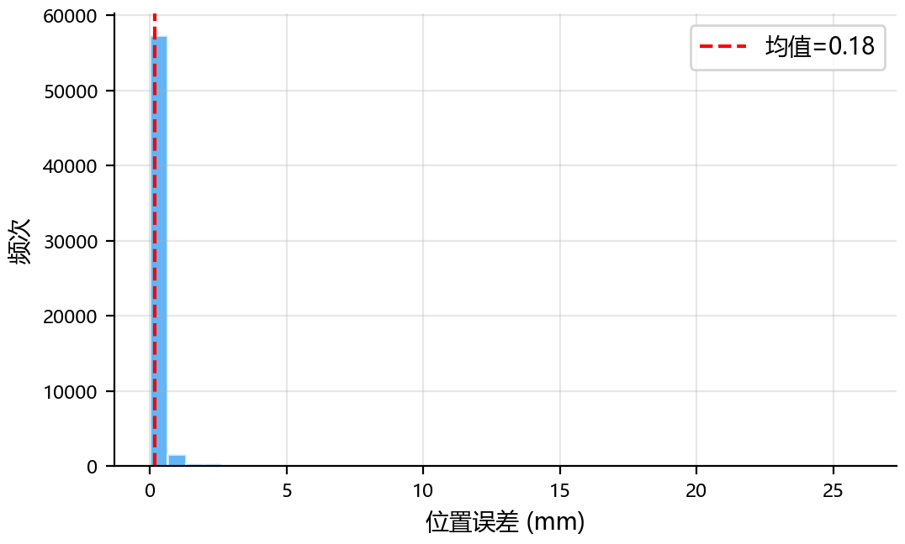

#### 姿态误差

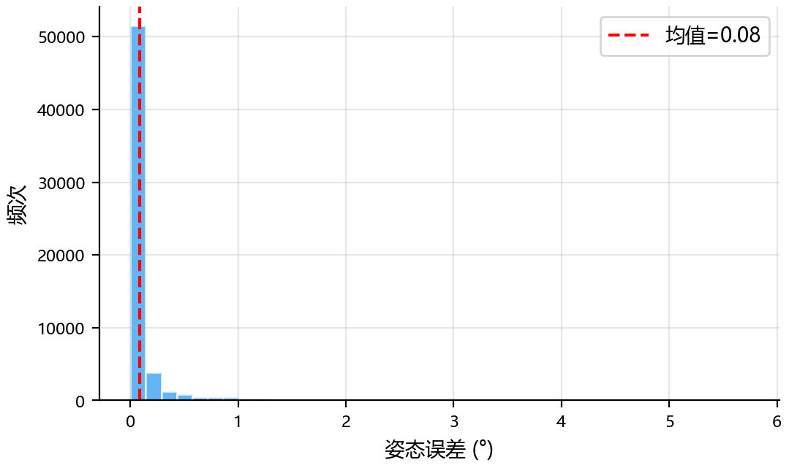

#### 速度误差

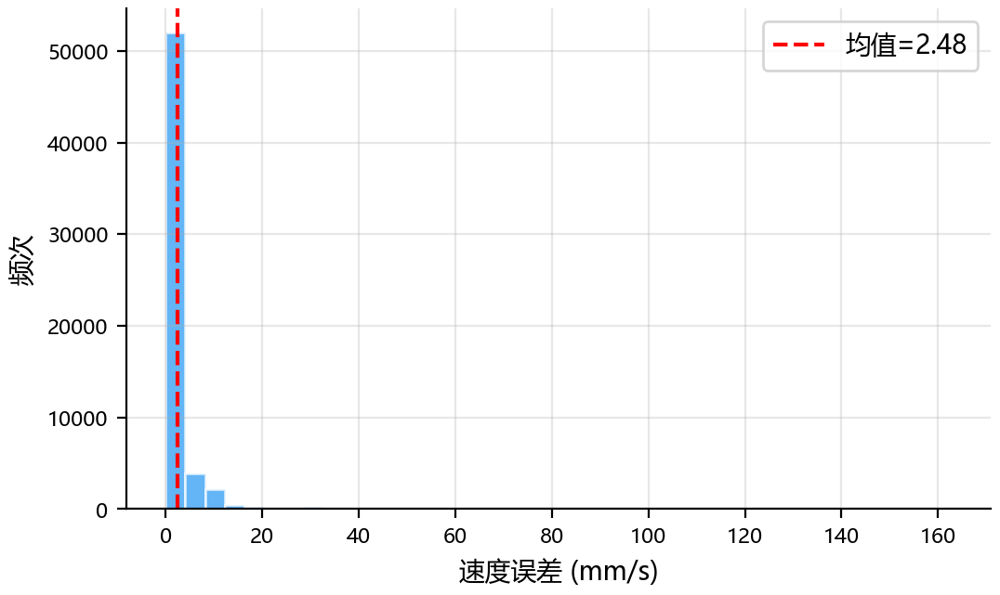

### 2.3 各焊缝误差对比

| 焊缝 ID | 位置 RMS (mm) | 位置 Max (mm) | 姿态均值 (°) | 速度 MAE (mm/s) |
|---------|--------------|--------------|-------------|----------------|
| 1 | 0.01 | 0.01 | 0.00 | 15.25 |
| 2 | 0.00 | 0.01 | 0.00 | 0.37 |
| 3 | 0.01 | 0.01 | 0.00 | 9.24 |
| 4 | 0.01 | 0.03 | 0.00 | 0.86 |
| 5 | 0.00 | 0.01 | 0.00 | 3.43 |
| 6 | 0.01 | 0.01 | 0.00 | 0.39 |
| 7 | 0.00 | 0.00 | 0.00 | 1.57 |
| 8 | 0.02 | 0.02 | 0.00 | 0.90 |
| 9 | 0.00 | 0.01 | 0.00 | 2.94 |
| 10 | 0.01 | 0.01 | 0.00 | 0.33 |
| 11 | 0.00 | 0.01 | 0.00 | 1.46 |
| 12 | 0.02 | 0.02 | 0.00 | 12.61 |
| 13 | 0.00 | 0.01 | 0.00 | 2.93 |
| 14 | 0.01 | 0.01 | 0.00 | 0.50 |
| 15 | 0.00 | 0.01 | 0.00 | 1.43 |
| 16 | 0.02 | 0.02 | 0.00 | 0.79 |
| 17 | 0.00 | 0.02 | 0.00 | 1.26 |
| 18 | 0.01 | 0.01 | 0.00 | 9.84 |
| 19 | 0.00 | 0.01 | 0.00 | 0.45 |
| 20 | 0.01 | 0.01 | 0.00 | 9.38 |
| 21 | 0.38 | 0.94 | 0.18 | 6.27 |
| 22 | 2.74 | 23.56 | 0.12 | 1.77 |
| 23 | 4.09 | 24.20 | 0.50 | 5.09 |
| 24 | 0.78 | 2.45 | 0.48 | 5.38 |
| 25 | 2.76 | 23.56 | 0.21 | 6.96 |
| 26 | 2.73 | 23.56 | 0.14 | 1.84 |
| 27 | 4.86 | 25.33 | 0.59 | 9.51 |
| 28 | 0.87 | 2.34 | 0.58 | 6.46 |
| 29 | 0.35 | 1.10 | 0.23 | 6.71 |
| 30 | 2.73 | 23.56 | 0.13 | 1.73 |
| 31 | 4.92 | 25.11 | 0.41 | 4.14 |
| 32 | 0.86 | 2.43 | 0.45 | 6.78 |
| 33 | 2.76 | 23.56 | 0.23 | 2.94 |
| 34 | 2.73 | 23.56 | 0.12 | 6.02 |
| 35 | 4.49 | 24.50 | 0.34 | 3.79 |
| 36 | 5.96 | 26.02 | 0.43 | 10.46 |
| 37 | 0.84 | 1.98 | 0.89 | 9.82 |
| 38 | 2.76 | 23.56 | 0.25 | 7.22 |
| 39 | 2.73 | 23.56 | 0.15 | 1.97 |
| 40 | 5.50 | 24.45 | 0.38 | 3.82 |

### 2.4 焊缝误差箱线图

### 2.5 TCP 速度时序

### 2.6 焊缝 #7 详细时序（表现最好）

#### 位置误差

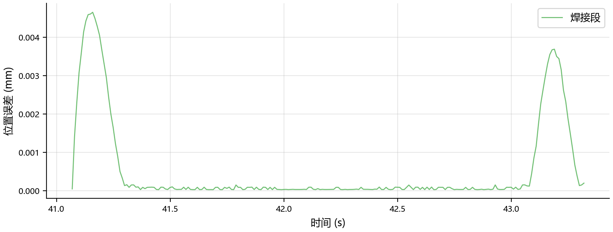

#### 姿态误差

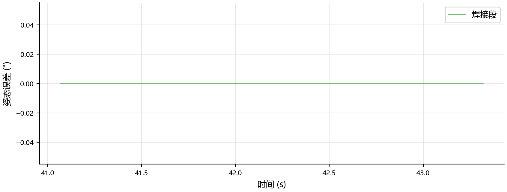

#### TCP 速度

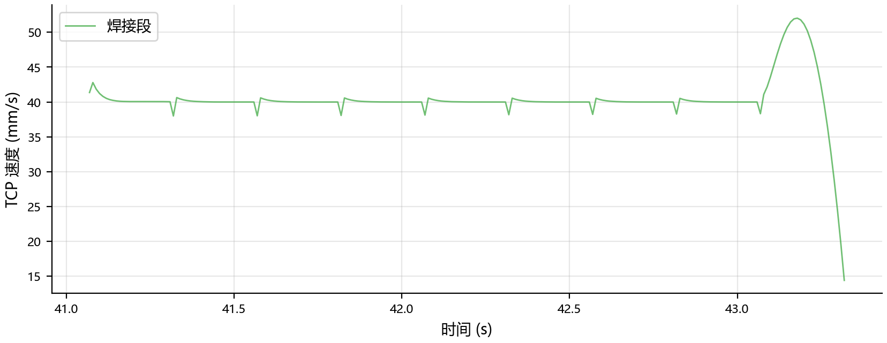

### 2.6 焊缝 #36 详细时序（表现最差）

#### 位置误差

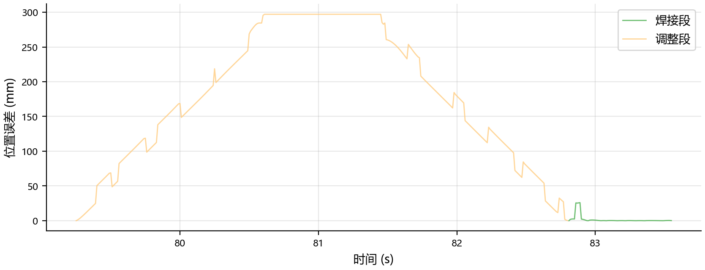

#### 姿态误差

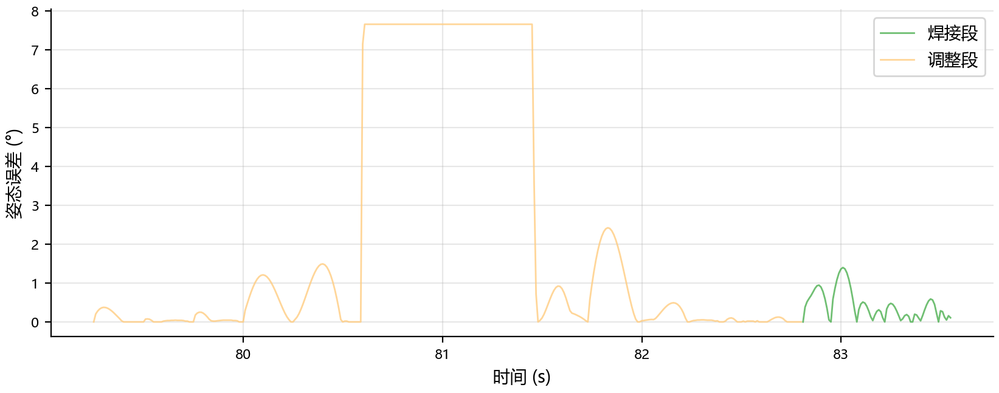

#### TCP 速度

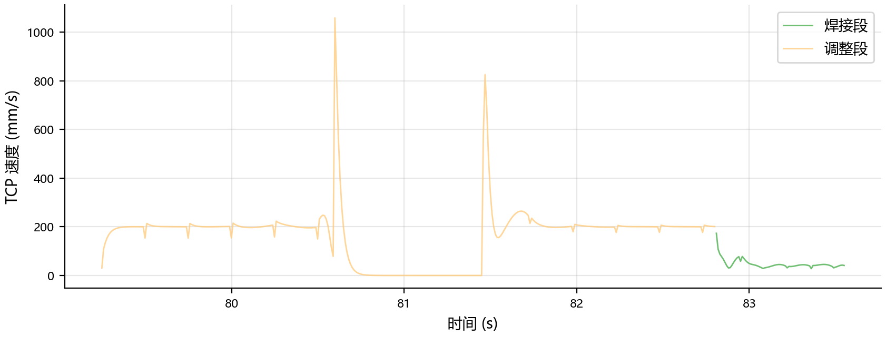

### 2.7 全程误差时序

#### 位置误差

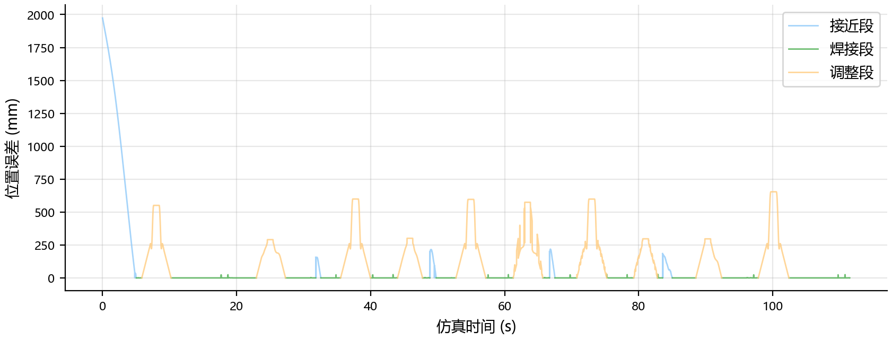

#### 姿态误差

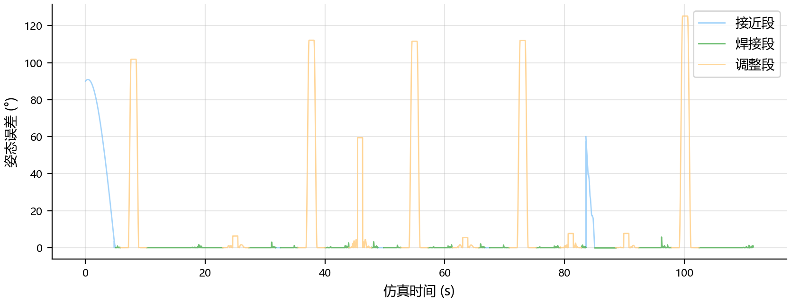

#### 速度误差

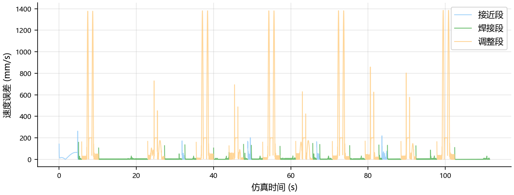

---

## 3. 安全性评估

### 3.1 重规划统计

| 指标 | 值 |
|------|-----|
| 总重规划次数（10 次运行合计） | 58 |
| 平均每次运行重规划次数 | 5.8 |
| RRT 成功率 | 100.0% |
| RRT 平均计算耗时 | 54.23 ms |
| RRT 最大计算耗时 | 256.78 ms |

### 3.2 重规划分析图

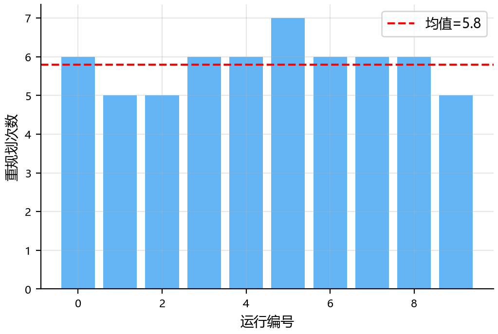

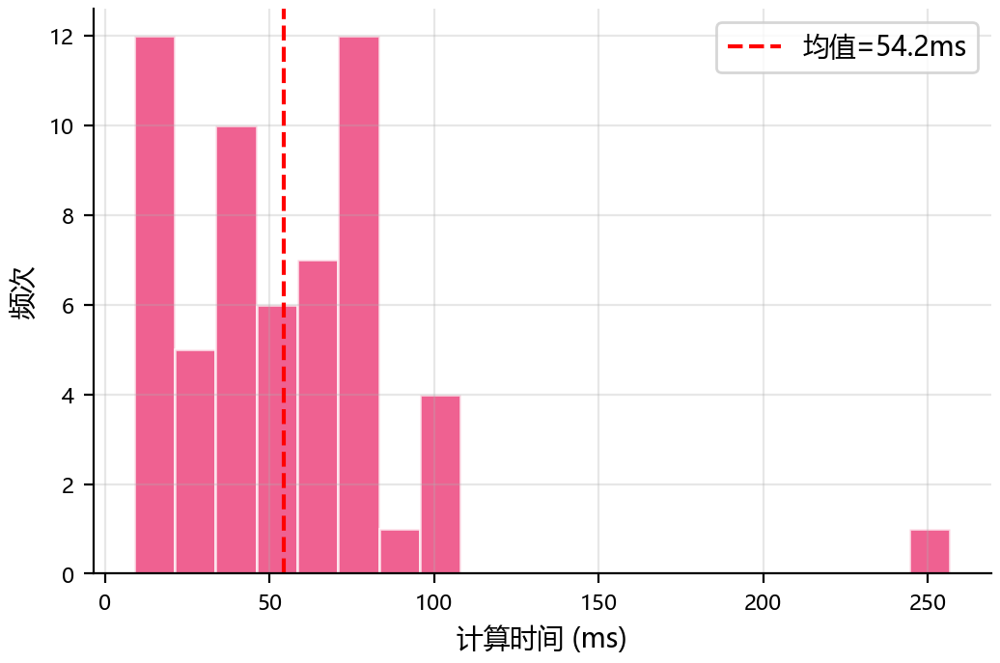

### 3.3 关节运动安全性

| 关节 | 角度最小值 (°) | 角度最大值 (°) | 最大角速度 (°/s) | 角加速度 RMS (°/s²) | 最大角加速度 (°/s²) |
|------|----------------|----------------|-------------------|---------------------|---------------------|
| J1 | -24.16 | 24.03 | 37.814 | 87.290 | 2084.236 |
| J2 | -10.05 | 68.10 | 39.540 | 118.793 | 3263.665 |
| J3 | -55.14 | 57.52 | 70.165 | 181.945 | 5777.246 |
| J4 | -179.38 | 178.37 | 376.213 | 758.823 | 20141.684 |
| J5 | -125.21 | 125.21 | 334.142 | 644.113 | 22007.674 |
| J6 | -356.86 | 58.75 | 321.120 | 551.605 | 12778.918 |

### 3.4 关节运动时序（典型焊缝）

#### 焊缝 #7（表现最好）关节运动

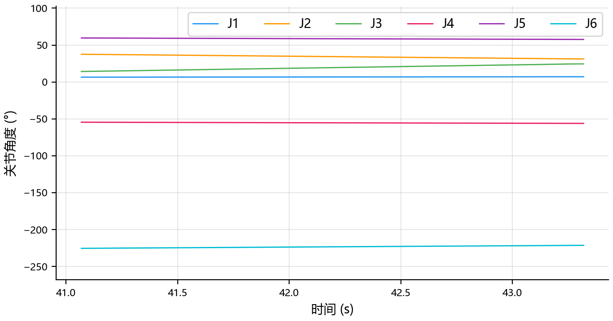

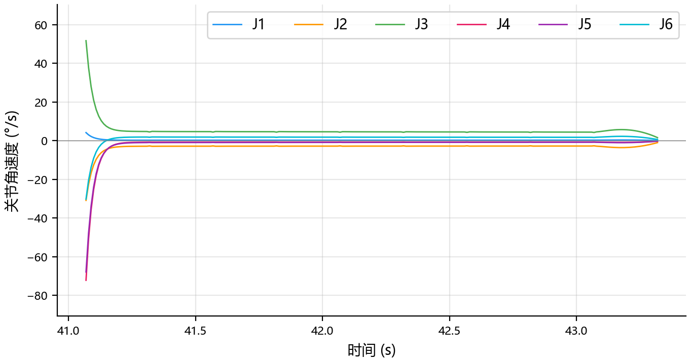

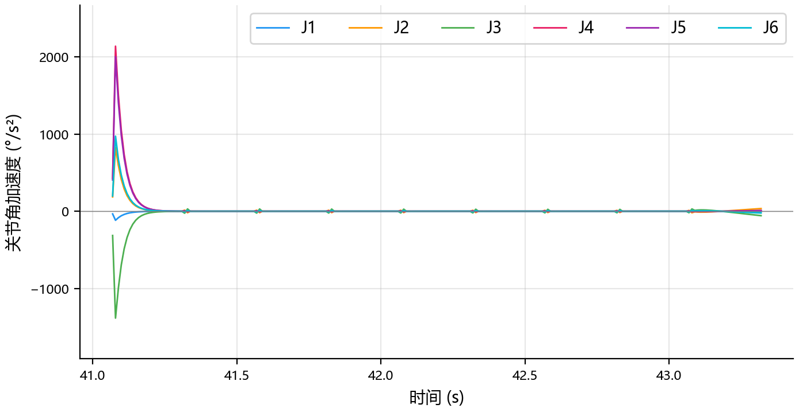

#### 焊缝 #36（表现最差）关节运动

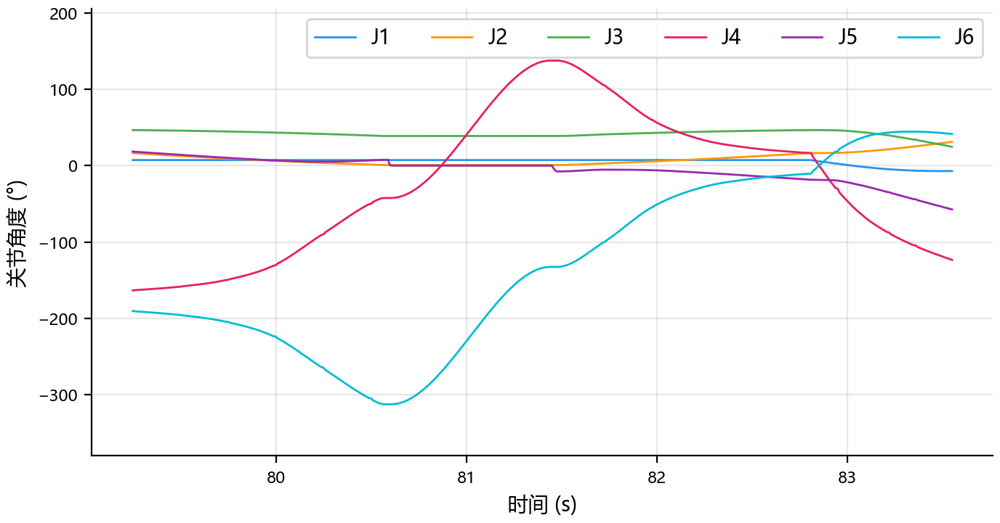

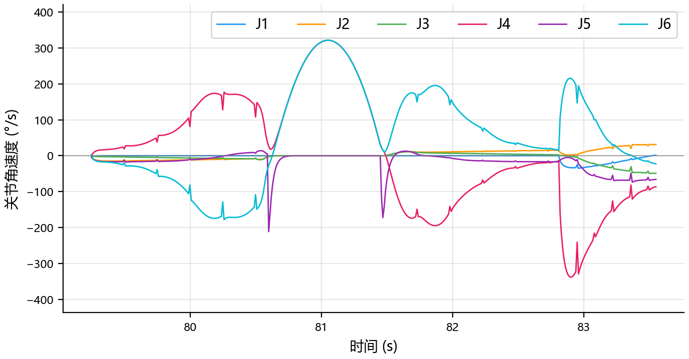

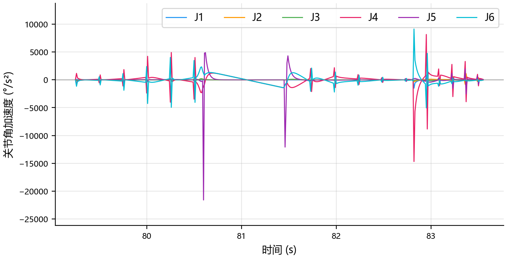

### 3.5 全程关节运动时序

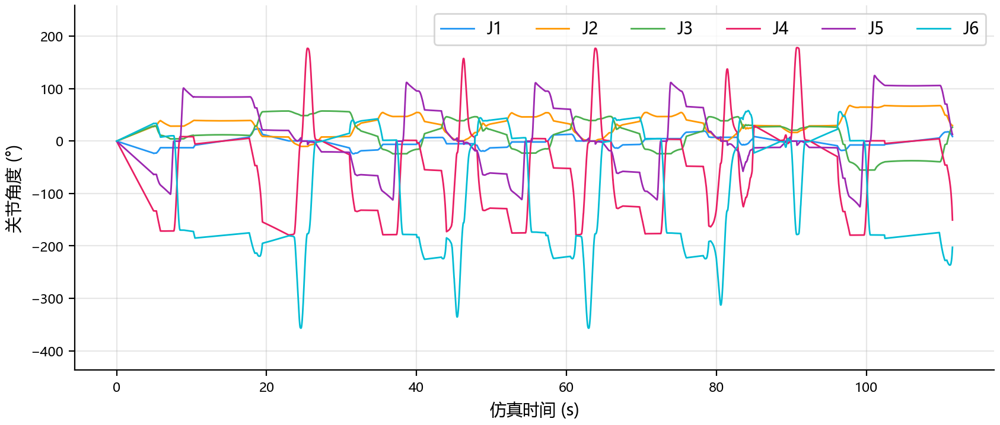

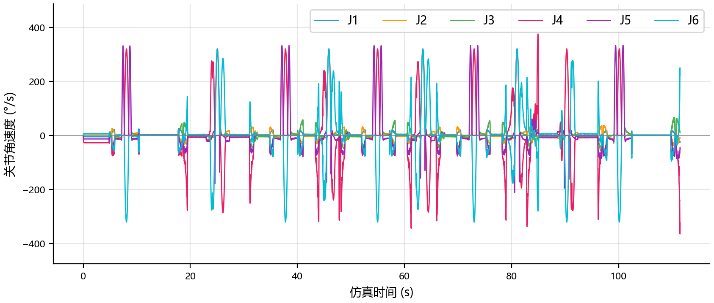

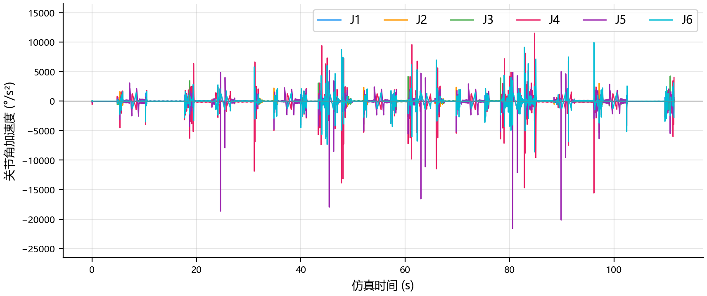

---

## 4. 仿真性能评估

| 指标 | 值 |
|------|-----|
| 平均任务完成时间 | 111.69 s |
| 时间标准差（运行间） | 0.22 s |
| 平均总帧数 | 11167 |
| 平均采样间隔 | 10.00 ms |

---

## 5. 关键发现

1. **任务成功率:** 100.0% (10/10 次运行成功)
2. **焊接精度:** 位置 RMS = 1.63 mm，姿态 MAE = 0.08°
3. **避障能力:** 10 次运行共触发 58 次重规划，成功率 100.0%
4. **运动平滑性:** 各关节加速度 RMS 在合理范围内（基于 EMA 平滑数据，α=0.3）
5. **仿真稳定性:** 任务完成时间标准差 0.22s，系统运行稳定

---

*报告生成时间: 2026-05-23 17:00:44*